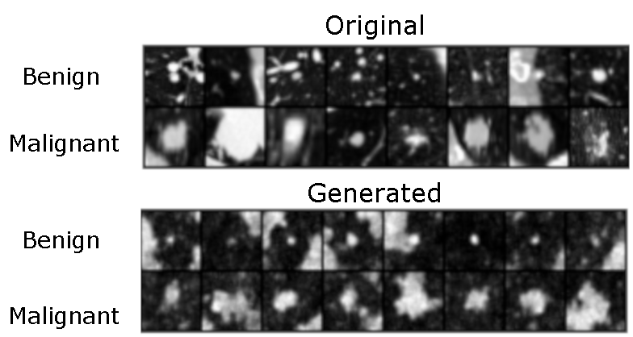

# Conditional Diffusion LIDC

[script.py](script.py) is a minimal, self-contained implementation of a conditional diffusion model. It learns to generate LIDC samples, conditioned on a benign/malignant labels. The neural network architecture is a small U-Net. This code is modified from [this excellent repo](https://github.com/cloneofsimo/minDiffusion) which does unconditional generation. The diffusion model is a [Denoising Diffusion Probabilistic Model (DDPM)](https://arxiv.org/abs/2006.11239).

Generated samples, the top graphics show original samples and the lower ones synthesized ones. 

